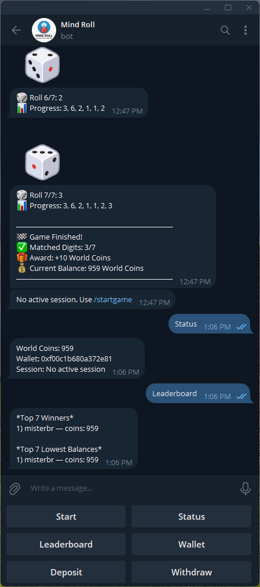
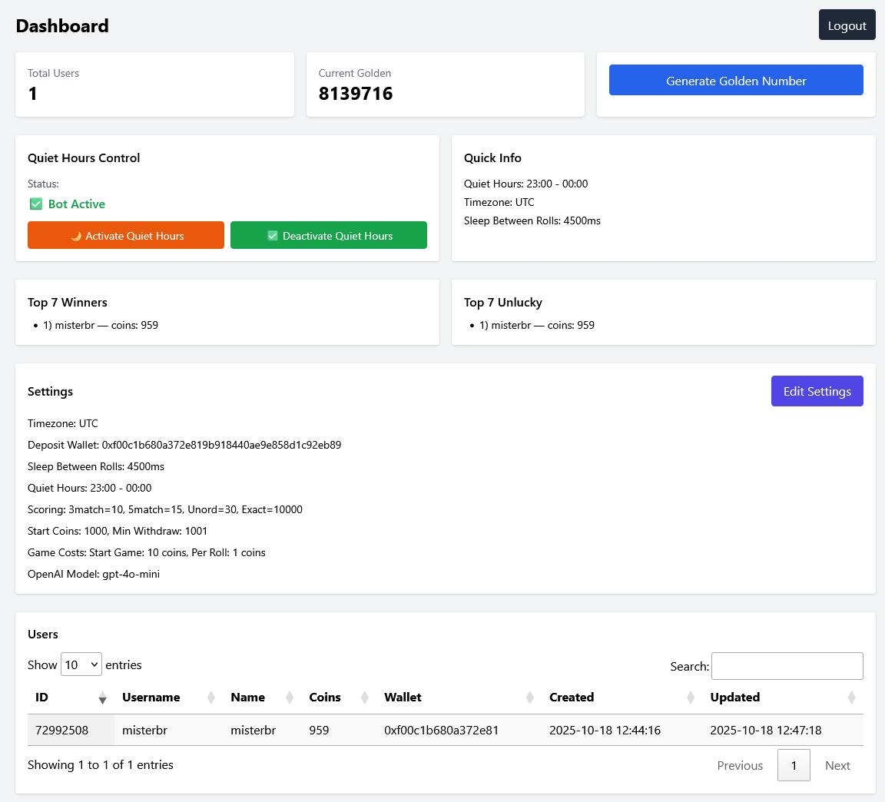

# Telegram Dice Game Bot v2 (PHP 8 + MySQL + OpenAI) — Full Setup & Deployment Guide

This project is a Telegram dice game bot where users collect 7 dice rolls to match a daily 7-digit "Golden Number" generated by OpenAI. Users earn "World Coins" based on matching digits. Built in PHP with SOLID architecture and MySQL persistence.

## Screenshots

### Telegram Bot Interface


### Admin Panel Dashboard


## Features
- **Daily 7-digit Golden Number**: generated at midnight via OpenAI (with fallback).
- **7 Dice Rolls per Session**: `/startgame` starts a session; `/next` rolls up to 7 dice (1–6).
- **Scoring System**: award coins based on how many digits match (3/5/7 unordered, or exact ordered match).
- **Transaction System**: comprehensive tracking of all financial movements (wins, losses, deposits, withdrawals, bonuses, refunds).
- **Game Session Controls**: pause, resume, and stop game sessions without losing progress.
- **Game Costs**: configurable costs for starting games and rolling dice.
- **World Coin Wallet**: users start with 1,000 coins; can set Worldcoin wallet address, deposit, and withdraw.
- **Commands**: `/startgame`, `/next`, `/pause`, `/resume`, `/stop`, `/status`, `/history`, `/stats`, `/wallet`, `/deposit`, `/withdraw`, `/leaderboard`.
- **Quiet Hours**: 23:00–00:00 — new sessions blocked; ongoing sessions can finish.
- **Reply Keyboard**: persistent buttons (Start/Next, Status, Leaderboard, Wallet, Deposit, Withdraw).
- **Admin Panel**: AJAX-based modal with toast notifications for managing all settings.

## Requirements
- **PHP** 8.1+ with PDO MySQL extension
- **MySQL/MariaDB**
- **Composer**
- **Web server**: Apache (with `mod_rewrite`, `AllowOverride All`) or Nginx (see config below)
- **Valid HTTPS** (SSL certificate) for Telegram webhook

## Folder Structure
```
public/
  game.php                     # Telegram webhook endpoint
  cron/
    generate-golden.php        # Daily golden number generation (00:00)
    quiet-hours-start.php      # Daily quiet hours notification (23:00)
src/
  App.php                      # Main application class
  Controllers/                 # TelegramController
  Services/                    # GameService, TelegramService, OpenAIService
  Repositories/                # UserRepository, GoldenRepository, TransactionRepository
  Models/                      # Database models
admin/
  index.php                    # Admin dashboard
  ajax.php                     # AJAX endpoints for settings
migrations/
  game_complete.sql            # Complete database schema
.env.example
composer.json
README.md
CRON_SETUP.md                 # Detailed cron jobs setup guide
```

## Step-by-step Setup

1) Upload/Clone the project on your host (prefer docroot → `public/`).

2) Install dependencies
```bash
composer install
```

3) Database (v2 schema)
- IMPORTANT: The consolidated schema includes transaction system and game session controls.
- Backup if you need old data.
- Import `migrations/game_complete.sql` via phpMyAdmin or CLI:
```bash
mysql -u <DB_USER> -p -h <DB_HOST> <DB_NAME> < migrations/game_complete.sql
```

4) Configure environment
- Copy `.env.example` → `.env` and fill values:
```
TELEGRAM_BOT_TOKEN=123456:ABC...
OPENAI_API_KEY=sk-...
OPENAI_MODEL=gpt-5
DB_HOST=localhost
DB_NAME=telegram_game
DB_USER=root
DB_PASS=
ADMIN_PASSWORD_HASH=
SLEEP_MS_BETWEEN_ROLLS=3000
LOG_REQUESTS=false
```
- `ADMIN_PASSWORD_HASH` (optional) enables login with username `admin`.
  Generate hash:
```bash
php -r "echo password_hash('YourStrongPassword', PASSWORD_BCRYPT), PHP_EOL;"
```

5) Web server & HTTPS
- Apache: enable `mod_rewrite`, set `AllowOverride All`.
- Docroot:
  - If docroot = `public/` → webhook URL ends with `/game.php`.
  - If docroot = project root → webhook URL ends with `/public/game.php`.
- `.htaccess` already enforces HTTPS, removes www, disables directory listing.

6) BotFather — create bot & set webhook
- In Telegram, open `@BotFather` → `/newbot` → get token.
- Set webhook (example domain `mindroll.misterbr.ir`):
```
# docroot = public
https://api.telegram.org/bot<YOUR_TOKEN>/setWebhook?url=https://mindroll.misterbr.ir/game.php&drop_pending_updates=true
# docroot = root
https://api.telegram.org/bot<YOUR_TOKEN>/setWebhook?url=https://mindroll.misterbr.ir/public/game.php&drop_pending_updates=true
```
- Set description and commands:
```
/help - Show all available commands
/status - Show your World Coins, session progress, and wallet
/startgame - Start a new 7-dice session
/next - Roll the next dice (up to 7 rolls)
/pause - Pause current game session
/resume - Resume paused game session
/stop - Stop current game session
/history - View your recent transaction history
/stats - View your game statistics
/wallet - View or update your Worldcoin wallet address
/deposit - Show the deposit address
/withdraw - Create a withdrawal request
/leaderboard - View top winners
```

7) Admin Panel
- Visit `/admin`.
- First‑run registration appears if there is no admin user.
- AJAX-based modal for editing settings with toast notifications.
- Manage settings (in DB `settings`):
  - `start_coins` (default 1000)
  - `withdraw_min_balance` (default 1001)
  - `deposit_wallet_address` (string)
  - `sleep_ms_between_rolls` (default 4500)
  - `quiet_hours_start` (23:00), `quiet_hours_end` (00:00)
  - `quiet_hours_active` (manual control: 0/1)
  - `game_start_cost` (cost to start a game, default 0)
  - `roll_cost` (cost per dice roll, default 0)
  - `score_match_3`, `score_match_5`, `score_all_unordered`, `score_exact_ordered`
  - `openai_model`
  - `timezone` (for cron jobs, default UTC)

8) Cron Jobs (2 daily jobs)
- **Quiet Hours Start (23:00)**: Notify all users that the bot will be inactive from 23:00 to 00:00.
```cron
0 23 * * * php /path/to/project/public/cron/quiet-hours-start.php >> /path/to/project/storage/logs/cron-quiet.log 2>&1
```
- **Generate Golden Number (00:00)**: Generate new 7-digit Golden Number and broadcast.
```cron
0 0 * * * php /path/to/project/public/cron/generate-golden.php >> /path/to/project/storage/logs/cron-golden.log 2>&1
```
- Or trigger manually from Admin panel → "Generate Golden Number" button.
- **Important**: Set timezone in Admin Panel for correct scheduling.
- See `CRON_SETUP.md` for detailed setup instructions.

9) Commands & Game Flow
- **`/startgame`**: Creates a new session for today's golden number. Deducts `game_start_cost` coins if configured. Blocked during quiet hours (23:00–00:00). First dice roll happens immediately.
- **`/next`**: Rolls the next dice (result 1–6), deducts `roll_cost` coins if configured, appends to session digits, sleeps `sleep_ms_between_rolls` ms (default 4500), then replies with progress (e.g., "Roll 3/7: 4 | Progress: 2, 5, 4").
- **`/pause`**: Pause the current game session without losing progress.
- **`/resume`**: Resume a paused game session.
- **`/stop`**: Stop the current game session (no award given).
- **After 7 rolls**: Scoring is computed and coins awarded:
  - **3 matching digits** (unordered) → `score_match_3` (default 10)
  - **5 matching digits** (unordered) → `score_match_5` (default 15)
  - **All 7 digits present**, wrong order → `score_all_unordered` (default 30)
  - **Exact 7-digit ordered match** → `score_exact_ordered` (default 10,000)
- **Transaction Recording**: All wins, losses, fees, and refunds are recorded in the `transactions` table.
- **On exact match**: ChatGPT generates and sends a personalized congratulatory message.

10) Wallet / Deposit / Withdraw
- **`/wallet`**: View current wallet address or set/update Worldcoin wallet address.
- **`/wallet <ADDRESS>`**: Set or update wallet address (stored in `users.wallet_address`).
- **`/deposit`**: Display the deposit address configured in Admin settings.
- **`/withdraw <AMOUNT>`**: Create a withdrawal request. The bot validates balance (minimum `withdraw_min_balance=1001`), deducts amount immediately, creates a transaction record. If withdrawal fails, amount is refunded automatically.
- **`/history`**: View recent transaction history (last 10 transactions).
- **`/stats`**: View comprehensive game statistics (total wins, losses, games played, win rate, etc.).
- Users start with `start_coins=1000` World Coins.

## Database Schema (summary)
- **`users`**: id, username, first_name, last_name, coins (default 1000), wallet_address (nullable), timestamps
- **`golden_numbers`**: id, number (VARCHAR(7)), source, announced, created_at
- **`game_sessions`**: id, user_id, golden_id, result_digits, rolls_count, throws_remaining, finished, **paused**, **paused_at**, score_awarded, timestamps
- **`rolls`**: id, session_id, user_id, result (1–6), step_index, cost, created_at
- **`transactions`** (NEW): id, user_id, type (deposit/withdraw/win/loss/bonus/refund), amount, golden_id, session_id, description, status (pending/completed/failed/cancelled), timestamps
- **`withdraw_requests`**: id, user_id, amount, status, api_response, timestamps (legacy, kept for backup)
- **`admin_users`**: id, username, password_hash, created_at
- **`settings`**: key/value store (all game settings configurable via Admin)

## Notes
- **UX**: Command-based with persistent Reply Keyboard (buttons: Start/Next, Status, Leaderboard, Wallet, Deposit, Withdraw). No inline keyboards.
- **Language**: All code, comments, and bot messages are in English.
- **Currency**: "World Coin" (earned by matching the golden number).
- **Quiet Hours**: 23:00–00:00 — users cannot start new sessions but can finish ongoing ones. Notification sent at 23:00.
- **Transaction System**: All financial movements are tracked with type, amount, status, and description.
- **Game Costs**: Configurable costs for starting games (`game_start_cost`) and rolling dice (`roll_cost`).
- **Error Handling**: Insufficient balance errors are caught and user-friendly messages are sent.
- **Webhook Logging**: Enable with `LOG_REQUESTS=true` → logs written to `storage/logs/`.
- **Worldcoin**: Integration is conceptual; actual API not yet implemented. Docs: https://docs.world.org/

## Troubleshooting
- **Webhook not invoked**: check `getWebhookInfo`, ensure HTTPS and correct docroot URL.
- **500 errors**: ensure `vendor/` exists, PHP version, DB credentials in `.env`.
- **DB errors**: re‑import `migrations/game_complete.sql`; confirm privileges.
- **Cron not running**: verify crontab path and PHP binary; check `storage/logs/cron-*.log`; ensure timezone is set in Admin Panel.
- **Insufficient balance errors**: Users will receive clear messages when they don't have enough coins for game start or rolls.
- **Transaction issues**: Check `transactions` table for detailed history and status.
- Set webhook as in step 6.
- Add Cron jobs as in step 8 (see `CRON_SETUP.md` for details).

### B) VPS (Ubuntu) + Apache
- Install Apache, PHP 8.1+, MySQL, Composer.
- VirtualHost example (docroot to `public/`):
```apache
<VirtualHost *:80>
    ServerName yourdomain.com
    Redirect permanent / https://yourdomain.com/
</VirtualHost>

<VirtualHost *:443>
    ServerName yourdomain.com
    DocumentRoot /var/www/project/public
    <Directory /var/www/project/public>
        AllowOverride All
        Require all granted
    </Directory>
    SSLEngine on
    SSLCertificateFile /etc/letsencrypt/live/yourdomain.com/fullchain.pem
    SSLCertificateKeyFile /etc/letsencrypt/live/yourdomain.com/privkey.pem
</VirtualHost>
```

### C) VPS (Ubuntu) + Nginx
- Sample server block (docroot to `public/`):
```nginx
server {
  listen 80;
  server_name yourdomain.com www.yourdomain.com;
  return 301 https://yourdomain.com$request_uri;
}

server {
  listen 443 ssl http2;
  server_name yourdomain.com;
  root /var/www/project/public;
  index index.php;

  ssl_certificate /etc/letsencrypt/live/yourdomain.com/fullchain.pem;
  ssl_certificate_key /etc/letsencrypt/live/yourdomain.com/privkey.pem;

  location / {
    try_files $uri $uri/ /index.php?$query_string;
  }

  location ~ \.php$ {
    include snippets/fastcgi-php.conf;
    fastcgi_pass unix:/run/php/php8.2-fpm.sock;
  }

  # Block sensitive files
  location ~ /\.(env|git|htaccess|gitignore) { deny all; }
}
```

### D) Local (Laragon/XAMPP)
- Place project in the web root (e.g., `laragon/www/mindroll`).
- Create DB, import `migrations/game.sql`.
- Copy `.env.example` → `.env` and set credentials.
- `composer install`.
- Access `http://mindroll.test` (Laragon) or `http://localhost/mindroll/public`.

## API Endpoints
| Method | Endpoint                | Description                                  |
| ------ | ----------------------- | -------------------------------------------- |
| POST   | `public/game.php`       | Telegram webhook (receives bot updates)      |
| GET    | `public/cron/generate-golden.php` | Cron job for generating daily golden number (00:00) |
| GET    | `/admin`                | Admin login/dashboard                         |

## Security & Best Practices
- Keep secrets in `.env` (already `.gitignore`).
- Ensure HTTPS and valid certificate (Telegram requires it).
- Apache: `mod_rewrite` + `AllowOverride All`; Nginx: use server block above.
- Our `.htaccess` enforces HTTPS, removes `www`, disables directory listing, and blocks sensitive files.
- Sanitize inputs; use prepared statements (already used via PDO prepared statements).

## Additional Troubleshooting
- **Webhook not triggered**: check `getWebhookInfo`, verify URL is HTTPS and reachable; confirm docroot path to `public/`.
- **500 errors**: check `vendor/` installed, PHP version, DB credentials in `.env`.
- **DB errors**: ensure DB exists and `migrations/game_complete.sql` imported; verify privileges.
- **Admin panel not loading**: ensure correct docroot. If docroot is `public/`, move `admin/` under `public/` or set a separate vhost with root at project directory.
- **OpenAI errors**: if API fails, fallback random number is used automatically.
- **Transaction tracking issues**: All game operations (start, roll, win, loss) create transaction records. Check the `transactions` table for debugging.
- **Paused sessions**: Users can pause/resume games. Paused sessions won't appear as active until resumed.

## License
MIT (see `composer.json`).
